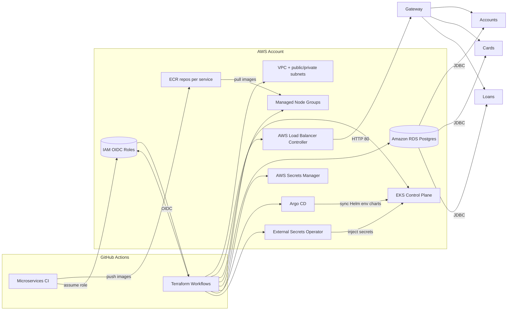
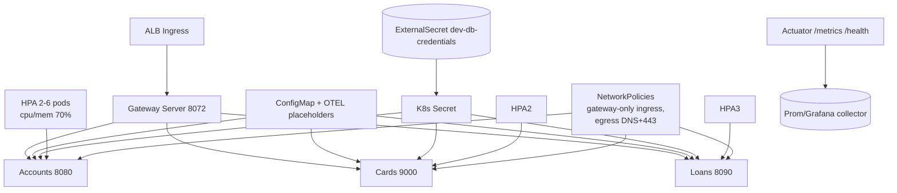
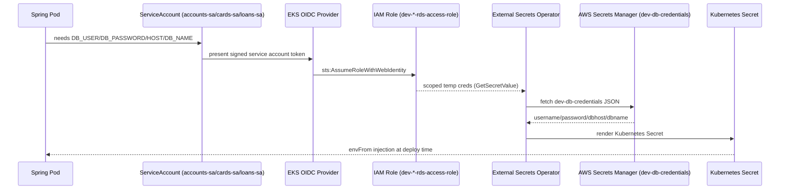
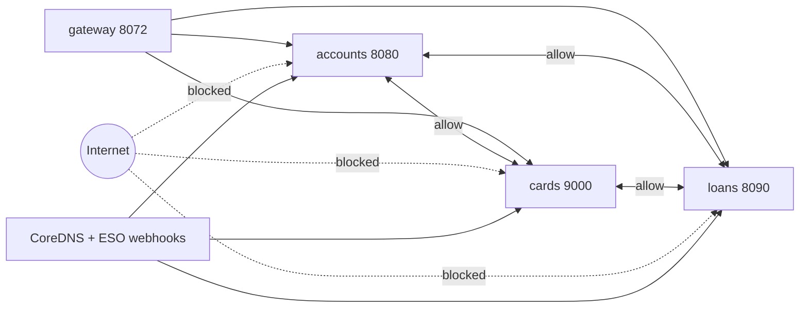

# Multi-Environment Banking Platform

[](https://github.com/OWNER/Multi-Environment-Microservices/actions/workflows/Microservice-Ci.yaml)
[](https://github.com/OWNER/Multi-Environment-Microservices/actions/workflows/terraform-validate.yaml)


-informational)

## Executive Summary

This repository shows the end-to-end modernization of a Spring Boot banking application from a Docker Compose lab into a production-grade, multi-environment platform. Terraform now provisions VPC, EKS, ALB, RDS, Secrets Manager, Argo CD, and per-service IRSA roles on AWS. Helm charts encapsulate Kubernetes policies (HPAs, NetworkPolicies, ConfigMaps, ExternalSecrets) for each microservice, while GitHub Actions deliver DevSecOps automation (tests, Trivy, Cosign, SBOMs, Terraform security gates) and push signed images to ECR before Argo CD performs GitOps syncs into EKS.

## Before vs. After

| Capability | Legacy Stack | Modernized Stack |
| --- | --- | --- |
| Deployment | Single Docker Compose file on laptops | Terraform-managed AWS infra + Argo CD GitOps |
| Service discovery & config | Eureka + Config Server + Feign | Native K8s DNS, ConfigMaps, External Secrets, lighter code |
| Datastore | Local JDBC/Postgres creds in configs | Amazon RDS in private subnets, credentials in AWS Secrets Manager |
| Networking | Flat network, no ingress, no policies | ALB Ingress Controller, per-service NetworkPolicies, zero egress |
| CI/CD | Manual Maven builds | GitHub Actions (lint/test, Trivy FS & image scans, Cosign signing, SBOM, artifact archival) |
| IaC & Governance | Hand-built infra | Terraform modules + remote state + Checkov/tfsec + manual approval gates |
| Security | Plain-text secrets, no signing | IRSA + External Secrets Operator, Cosign signing, GitHub OIDC, S3 artifact trails |
| Scalability | Static containers | HPAs (2–6 pods, CPU/Mem @70%), ALB target-type ip, EKS managed nodes |

## Cloud Architecture



## Kubernetes Architecture



## Repository & Folder Map

```text
Multi-Environment-Microservices/
├─ accounts | cards | loans | gatewayserver      # Spring Boot services (8080/9000/8090/8072)
├─ helm/
│  ├─ bankingapp-common/                         # Shared Helm templates (Deployment, SA, HPA, NetworkPolicy)
│  ├─ bankingapp-services/<service>/             # Service-specific values + ingress/HPA overrides
│  └─ environments/{dev,stag,prod}-env/          # App-of-app Helm chart consumed by Argo CD
├─ terraform/
│  ├─ environments/{dev,stag,prod}/              # Remote-state stacks (S3 + DynamoDB locking)
│  └─ modules/{vpc,eks,ecr,rds,secrets,iam}/     # Reusable AWS building blocks incl. ALB ctrl & Argo CD
├─ .github/
│  ├─ workflows/                                 # Microservice CI + Terraform (validate/plan/apply)
│  ├─ scripts/                                   # Maven, Trivy, Cosign, Terraform helpers
│  └─ actions/                                   # Composite actions (AWS OIDC, caching, terraform setup)
└─ docker-compose.yaml                           # Legacy reference for local smoke testing
```

## CI/CD & DevSecOps Flow

- **Microservices pipeline (`.github/workflows/Microservice-Ci.yaml`):** dorny path-filter chooses changed services, runs Maven lint/tests, executes Trivy FS scans, builds multi-arch images with Buildx, pushes to ECR using GitHub OIDC, performs Trivy image + SBOM scans, Cosign signs and verifies images, and uploads every artifact (tests, scans, SBOM, build metadata) to S3.
- **Terraform guardrails:** `terraform-validate` workflow enforces `terraform fmt`, multi-env `terraform validate`, and parallel Checkov + tfsec scans before artifacts are archived. `terraform-plan` produces per-environment binary/text/JSON plans and stores them for manual review. `terraform-apply` reuses signed plans, enforces branch protections, and tags prod deployments.
- **Observability hooks:** every Spring service exposes `/actuator/health/*` and `/actuator/prometheus`, so probes + Prometheus scrapers can reuse the same endpoints. OTEL exporters are parameterized in `helm/environments/*/values.yaml`.
- **Artifact integrity:** GitHub Actions writes SBOMs, Trivy reports, Terraform plans, and apply logs to S3 (`my-ci-artifacts55`) for auditability.

## IRSA + External Secrets Flow



## Zero-Trust NetworkPolicy Model



NetworkPolicies are generated from `helm/bankingapp-common/templates/_networkpolicy.tpl` and limit ingress to gateway + explicit peers, while egress is constrained to sibling services plus UDP 53/TCP 443 for DNS and AWS APIs (External Secrets). This enforces pod-to-pod isolation and parity with zero-trust expectations.

## GitOps Deployment Workflow

1. Helm environment charts (`helm/environments/dev-env`, etc.) reference the packaged service charts and template shared ConfigMaps, ExternalSecrets, and SecretStores.
2. Terraform installs Argo CD (`helm_release.argocd`) and the AWS Load Balancer + External Secrets operators inside EKS.
3. Argo CD monitors this repository, syncs the environment chart per namespace, and continuously reconciles Deployments, Services, HPAs, NetworkPolicies, and ExternalSecrets.
4. GitHub Actions push new container tags (`v1.0.0`, `latest`) to ECR; Argo CD picks up the image tag bump committed to Git, guaranteeing Git-driven rollouts and instant rollbacks.

## Deployment Guide

1. **Prerequisites:** AWS CLI v2, kubectl, helm, Terraform ≥1.6, Cosign, and access to an AWS account with permissions to create EKS/RDS/VPC resources. Configure an S3 bucket and DynamoDB table (see `terraform/environments/*/backend.tf`).
2. **Clone & bootstrap:** `git clone` this repo, create a GitHub OIDC role (module `iam/github_oidc` does this), and populate required secrets (`AWS_ACCOUNT_ID`, `AWS_REGION`, artifact bucket) in GitHub.
3. **Customize environment vars:** edit `terraform/environments/<env>/variables.tf` & `*.tfvars` for CIDRs, instance sizes, and DB settings. Adjust Helm overrides in `helm/environments/<env>-env/values.yaml` for replica counts, ingress hostnames, and service account annotations.
4. **Plan infrastructure:** run `terraform -chdir=terraform/environments/dev init` followed by `terraform plan -var-file=dev.tfvars`. Alternatively trigger the `Terraform Plan` GitHub workflow with the target environment.
5. **Apply infrastructure:** approve the plan via `terraform-apply` workflow (dev auto-approve optional; staging/prod require uploaded plan artifacts). Terraform provisions VPC, EKS, node groups, ALB controller, External Secrets Operator, RDS, Secrets Manager, ECR repos, IRSA roles, and Argo CD.
6. **Build & publish services:** push to `main` to trigger `CI for Microservices`. The workflow builds all changed services, scans/signs images, and pushes to `063630846340.dkr.ecr.us-east-1.amazonaws.com/<service>:<tag>`.
7. **Sync Kubernetes via GitOps:** update the Helm image tag in `helm/bankingapp-services/<service>/values.yaml` (or environment overrides) and let Argo CD detect/roll out the revision. Verify via `kubectl get pods,ingress,hpa,networkpolicy`.
8. **Smoke test:** hit the ALB DNS on port 80 → `gatewayserver` (8072) → `/api/{accounts,cards,loans}`. Use `/actuator/health` and `/actuator/prometheus` for liveness and metrics validation.

## 11. How Recruiters / Hiring Managers Should Read This Project

This project demonstrates the ability to:

- Take a legacy, non-cloud-ready system and deliver a full modernization roadmap plus execution.
- Implement Terraform-based AWS infrastructure from scratch (VPC, EKS, managed node groups, RDS, IAM/IRSA, ECR, ALB controller, Secrets Manager, Argo CD, External Secrets Operator).
- Design a secure, scalable Kubernetes deployment with service-per-chart Helm layout, centralized `bankingapp-common` templates, HPAs (2–6 pods, CPU/memory @70%), and NetworkPolicies for zero-trust communication.
- Operate dual CI/CD pipelines: Microservices delivery (build → test → scan → sign → push → SBOM) and Terraform delivery (fmt/validate → security checks → plan → approval → apply).
- Apply best-practice cloud security: IRSA workload identity, AWS Secrets Manager via External Secrets, NetworkPolicies restricting ingress/egress, GitHub OIDC federation, Cosign signature verification, and artifact archival in S3.
- Adopt GitOps (Argo CD) for declarative, auditable releases across `dev`, `stag`, and `prod` Helm environment charts.

In short, the repository reflects production-ready DevOps/Platform Engineering work that stands up an entire banking platform on AWS with automation, security, and observability wired in.

## 12. Skills Demonstrated

### 12.1 Cloud & AWS

- EKS cluster design & provisioning (`terraform/modules/eks`) with control-plane logging and managed node groups.
- VPC networking (public/private subnets, security groups, route tables in `terraform/modules/vpc`).
- RDS Postgres provisioning and secure connectivity through private subnets plus generated credentials (`terraform/modules/rds` + `modules/secrets`).
- ECR repositories per service with versioned tags; used by GitHub Actions Buildx jobs.
- IAM OIDC provider & IRSA roles for each service account (`terraform/modules/iam/*`).
- ALB Ingress Controller installation via Helm release, exposing the gateway service on HTTP 80.

### 12.2 Kubernetes & Helm

- Multi-service deployment with individual charts under `helm/bankingapp-services/*`.
- DRY shared templates in `helm/bankingapp-common` for Deployments, HPAs, NetworkPolicies, ServiceAccounts, and Services.
- HPAs defined per service (autoscaling/v2) to keep CPU/memory utilization near 70%.
- NetworkPolicies enforcing explicit ingress/egress matrices and DNS/443 exceptions only.
- ConfigMaps for shared runtime configuration plus ExternalSecret/SecretStore objects for secret injection.

### 12.3 Infra-as-Code (Terraform)

- Environment-based structure (`terraform/environments/{dev,stag,prod}`) with remote state (S3) and DynamoDB locking.
- Reusable modules for VPC, EKS, RDS, IAM, ECR, Secrets, ALB controller, External Secrets Operator, and Argo CD.
- Automated validation, linting, and security scanning (`terraform-validate` workflow uses fmt, validate, Checkov, tfsec, and custom scripts).
- Workflow-driven plans (`terraform-plan`) and manual approvals before applies, aligning with team change-control processes.

### 12.4 CI/CD & GitHub Actions

- Multi-stage microservices workflow: Maven lint/tests → Trivy FS scan → Buildx image build → ECR push → Trivy image scan + SBOM → Cosign sign/verify → artifact upload to S3.
- Separate Terraform workflows for validate, plan, and apply with environment inputs and approval gates.
- Manual approval (plan artifact review) required for Terraform apply; dev can opt into auto-approve while staging/prod require uploaded plans.
- Integrations with ECR, helm packaging, Argo CD GitOps, and S3 artifact archival for audit trails.

### 12.5 Security & Networking

- AWS Secrets Manager + External Secrets Operator eliminate plaintext credentials; IRSA ensures least-privilege access.
- Network segmentation via generated NetworkPolicies with per-service allowlists and restricted egress.
- ALB ingress configuration (gateway chart) with target-type `ip`, HTTP listener, and pod-level targeting.
- Continuous security scanning: Trivy FS/image, Checkov, tfsec, Cosign signatures, SBOM creation, and GitHub OIDC trust relationships.

### 12.6 GitOps & Release Engineering

- Argo CD installed via Terraform Helm release; monitors `helm/environments/*` charts.
- Declarative, versioned deployments (Helm values define image tags, replica counts, SA annotations).
- Automated sync, drift detection, and rollback via Git history; aligns with GitOps best practices.

## 13. Future Improvements

Intentional next steps to keep evolving the platform:

1. **Observability Stack**
   - Add Prometheus + Grafana (or Amazon Managed Prometheus/Grafana) to consume existing `/actuator/prometheus` endpoints.
   - Layer centralized logging (Loki or ELK) and define alert rules tied to SLOs.
2. **Progressive Delivery**
   - Introduce Argo Rollouts or Flagger for canary/blue-green strategies.
   - Use ALB annotations for traffic shifting during rollouts.
3. **Policy as Code**
   - Add OPA/Gatekeeper or Kyverno to enforce guardrails (no privileged pods, mandatory resource limits, etc.).
4. **More Environments**
   - Expand the current dev/stag/prod Helm + Terraform stacks into separate AWS accounts or workspaces for stronger isolation.
5. **Cost Optimization**
   - Right-size node groups and RDS instances; consider spot nodes for non-prod workloads.
6. **Advanced Security**
   - Integrate container scanning into the registry lifecycle, add AWS WAF in front of ALB, and enable mTLS between services (service mesh).
7. **Resilience & Automation**
   - Automate schema migrations (Flyway/Liquibase) within CI, and add chaos experiments (Litmus or AWS FIS) to validate resilience patterns.

---

This README is intentionally concise yet comprehensive so a senior DevOps leader or hiring manager can quickly understand the modernization story, the current production-ready architecture, and the technical competencies proven by the implementation.

